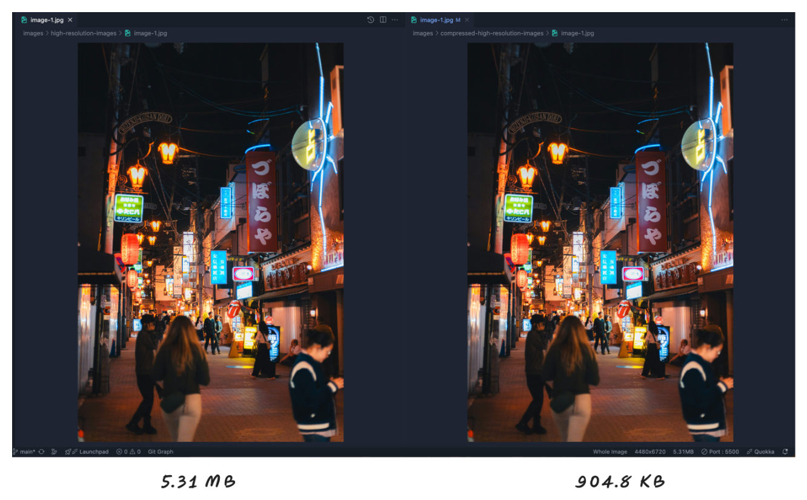

# Table of content
<!-- @import "[TOC]" {cmd="toc" depthFrom=2 depthTo=6 orderedList=false} -->

<!-- code_chunk_output -->

- [Unsplash implements lazy loading of images too](#unsplash-implements-lazy-loading-of-images-too)
- [Why browser-level lazy loading?](#why-browser-level-lazy-loading)
- [Default loading behaviour of images are "eager"](#default-loading-behaviour-of-images-are-eager)
- [Lazy loading attribute](#lazy-loading-attribute)
- [Give your images dimension attributes](#give-your-images-dimension-attributes)
- [React Lazy loading library](#react-lazy-loading-library)
- [Unsplash uses this to create a blurred placeholder image](#unsplash-uses-this-to-create-a-blurred-placeholder-image)
- [Load High-Resolution Images](#load-high-resolution-images)
- [Create a placeholder image using ffmpeg](#create-a-placeholder-image-using-ffmpeg)
- [Compress high resolution image using ffmpeg](#compress-high-resolution-image-using-ffmpeg)
- [Compress image and convert from JPG to WebP using ffmpeg](#compress-image-and-convert-from-jpg-to-webp-using-ffmpeg)
- [Srcset](#srcset)
- [Note:](#note)

<!-- /code_chunk_output -->

## Unsplash implements lazy loading of images too

If you open Unsplash and enable throttling to `Fast 4G` or `Slow 4G`, then scroll quickly, you'll notice that low-resolution (blurred) images appear first while high-resolution images load in the background. This serves as inspiration for creating a similar effect using lazy loading—an effective image optimization technique.

<p align="center">

</p>

## Why browser-level lazy loading?

According to the [HTTP Archive](https://httparchive.org/reports/page-weight), images are the most-requested asset type for most websites, and they usually take up more bandwidth than any other resource. At the 90th percentile, sites send over 5 MB of images on desktop and mobile.

Previously, there were two ways to defer the loading of off-screen images:

- Using the Intersection Observer API
- Using scroll, resize, or orientationchange event handlers

Either option can let developers include lazy loading behavior, and many developers have built third-party libraries to provide abstractions that are even easier to use.

With lazy loading supported directly by the browser, however, there's no need for an external library. Browser-level lazy loading also ensures that loading of images still works even if the client disables JavaScript. Note however that loading is only deferred when JavaScript is enabled.

**Ref**: [Browser-level image lazy loading for the web](https://web.dev/articles/browser-level-image-lazy-loading)

## Default loading behaviour of images are "eager"

`loading="eager"` is the default loading behavior of the browser, which is the same as not including the attribute and means the image is loaded regardless of where it's located on the page.

## Lazy loading attribute

The `loading="lazy"` attribute is widely supported across modern browsers, allowing images to load only when they are about to enter the viewport.

Chrome loads images at different priorities depending on where they're located relative to the device viewport. Images below the viewport are loaded with a lower priority, but they're still fetched as the page loads.

**Ref**: [Can I Use - loading="lazy" Attribute](https://caniuse.com/loading-lazy-attr)

`loading="lazy"` not supported in:
- Safari (macOS & iOS) before version 16.4
- Internet Explorer (IE)

Since Safari (before v16.4) and older browsers don’t support `loading="lazy"`, you can use JavaScript Intersection Observer as a fallback.

**Note**:
- lazy loading may not always improve performance if overused.
- While using lazy loading, make sure to provide a image dimension beforehand.

## Give your images dimension attributes

While the browser loads an image, it doesn't immediately know the image's dimensions, unless they're explicitly specified.

To let the browser reserve enough space on a page for images, and avoid disruptive layout shifts, we recommend adding width and height attributes to all `` tags.

<p align="center">
    
</p>

This prevents the annoying content shift that occurs during image loading, also known as **layout shift**.

The best practice of setting dimensions applies to `` tags regardless of whether you're lazy loading them, but lazy loading can make it more important.

Lazy loading in Chromium is implemented in a way that makes images more likely to be loaded as soon as they're visible, but there's still a chance that they won't load at the right time. If that happens, not specifying width and height on your images increases their impact on Cumulative Layout Shift. If you can't specify your images' dimensions, lazy loading them can save network resources at the risk of these increased layout shifts.

In most scenarios, images still lazy load if you don't specify dimensions, but there are a few edge cases you should be aware of. Without width and height specified, image dimensions default to 0×0 pixels. If you have a gallery of images, the browser might decide that all of them fit inside the viewport at the start, because each image takes up no space and no image is pushed offscreen. In this case, the browser decides to load everything, making the page load more slowly.

## React Lazy loading library

A lightweight library optimized for lazy loading images with placeholders.

**Ref**: [NPM - react-lazy-load-image-component](https://www.npmjs.com/package/react-lazy-load-image-component)

## Unsplash uses this to create a blurred placeholder image

BlurHash is a compact representation of a placeholder for an image.

<p align="center">

</p>

Read more:
- [BlurHash](https://blurha.sh/)
- [Github - BlurHash](https://github.com/woltapp/blurhash)
- [Fast & tiny Wolt BlurHash decoder implementation](https://github.com/mad-gooze/fast-blurhash?tab=readme-ov-file)

## Load High-Resolution Images

Check out the initial code using:

```bash
$ git checkout 50bb7f1
```

Now, open `index.html` in your browser. In DevTools, go to the **Network** tab and select the **Images** filter—you'll see a total of 16 image requests being made.

To observe the impact, enable **throttling** and switch to **Fast 4G** or **Slow 4G**.

after applying lazy=loading attribute, only 12 images get download and loaded, and rest 4 gets loaded once it's closer to viewport.

## Create a placeholder image using ffmpeg

```bash
$ ffmpeg -i input.jpg -vf scale=20:-1 output.jpg
```

The `-vf scale=20:-1` option in FFmpeg applies a video filter (-vf) to resize the image/video while maintaining its aspect ratio.

Breaking it down:
- `scale=20:-1` → Rescales the video width to 20 pixels while automatically adjusting the height.
- `20` → Sets the width to 20 pixels.
- `-1` → Automatically calculates the height to maintain the original aspect ratio.

## Compress high resolution image using ffmpeg

```bash
$ ffmpeg -i input.jpg -q:v 15 output.jpg
```

The quality values range from 1 to 31, where 1 represents the highest quality (and largest file size) and 31 represents the lowest quality (and smallest file size).

There are other option to reduce the image size furthur using `-compression_level` which you can explore.

<p align="center">
 
</p>

## Compress image and convert from JPG to WebP using ffmpeg

```bash
$ ffmpeg -i input.jpg -quality 80 output.webp
```

This is used to convert an image (e.g., JPEG, PNG, etc.) to another format (e.g., WebP) while specifying the quality level of the output image. The value 95 is the quality percentage, where: `100` is the highest quality (larger file size) and `0` is the lowest quality (smaller file size).

This option is commonly used when converting images to WebP format, as WebP supports lossy compression with adjustable quality.

WebP is a modern image format developed by Google that offers several advantages over traditional formats like JPEG and PNG. Here are the key benefits of using WebP images.

WebP provides better compression efficiency compared to JPEG and PNG, resulting in smaller file sizes without sacrificing quality.

Lossy Compression: WebP lossy images are typically 25-34% smaller than equivalent JPEG images at the same quality level.

Lossless Compression: WebP lossless images are 26% smaller than PNG images on average.

Smaller image sizes mean faster loading times for web pages, which improves user experience and SEO rankings. WebP is particularly beneficial for mobile users with limited bandwidth.

- https://caniuse.com/webp

For eg:

images/high-resolutions-images/image-1.jpg is of size 5.3M, after conversation image size reduced to 979k, almost 81% of the reduction.

If you open devtools -> go to network tab -> select img, earlier the total download size of 24 images was nearly ~74MB but after reduction it reduced down 10.8MB

## Srcset

With srcset attribute, you can save bandwidth by getting different image based on the device pixel ratio (DPR) and resolution, so that you can ensure that people are getting the high resolution images when they need.

You wouldn't want to force a low-end device to download a very high resolution image, only to downscale it locally. You also don't want high-end devices to upscale low resolution images for a blurry user experience.

You can load images based on the device pixel density on which the end user are in, so if the user are using high pixel density device it's gonna give them a nice high res image if they're on a just regular computer screen with 72 DPI they don't need to load
the bug heavy images, they can get the lower quality one which one would perfectly fine for them.

Another way, you can load the images based on the width of the viewport they are in, you can different version of the same image and load them based on the viewport which would be bigger in case of desktop, then tablet or mobile.

The image doesn't know what it would be it's size before it's load, so image first has to load in then it knows how big it is. So with "srcset" where we provided a multiple source, we want it load the right image based on the circumstances it's in which is based on the resolution and DPR. So with srcset, it won't load all the images, it will only load the image which matches the circumstances.

## Note:
2. Imgbot - Automatic image compression tool which is available inside github, once you push the changes, it will reduce down your images to some percentage.
